# Hi, I'm Kevin Guo

Software engineer with a full-stack background, exploring DevOps and AI infrastructure.
Interested in automation, developer productivity, and reliable software.

## Blog

[kevinguo.ink](https://kevinguo.ink) — I write about software engineering and share what I'm learning.

## Tech Stack

<a href="https://github.com/tandpfun/skill-icons">
  <picture>
    <source media="(prefers-color-scheme: dark)" srcset="https://skillicons.dev/icons?i=rust%2Cpython%2Cfastapi%2Cjs%2Cts%2Cnuxt%2Ctailwind%2Cdocker&amp;theme=dark&amp;perline=8">
    
  </picture>
</a>

## GitHub Stats

  <picture>
    <source media="(prefers-color-scheme: dark)" srcset="./profile/stats-dark.svg">
    
  </picture>
  <picture>
    <source media="(prefers-color-scheme: dark)" srcset="./profile/languages-dark.svg">
    
  </picture>

